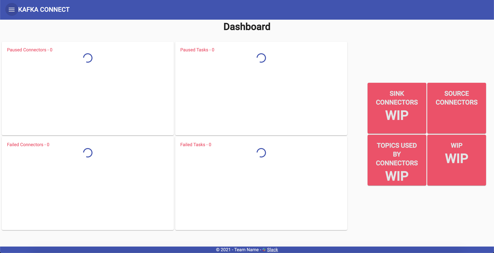

# Kafka-Connect-UI
This is the Kafka UI to manage the Kafka cluster



This project was generated with [Angular CLI](https://github.com/angular/angular-cli) version 11.0.3.

## Environment variables

KAFKA_CONNECT_DOMAIN : 'KAFKA_CONNECT_CLUSTER_HOST_NAME'

## Development server

Run `ng serve` for a dev server. Navigate to `http://localhost:4200/`. The app will automatically reload if you change any of the source files.

## Code scaffolding

Run `ng generate component component-name` to generate a new component. You can also use `ng generate directive|pipe|service|class|guard|interface|enum|module`.

## Build

Run `ng build` to build the project. The build artifacts will be stored in the `dist/` directory. Use the `--prod` flag for a production build.

## Running unit tests

Run `ng test` to execute the unit tests via [Karma](https://karma-runner.github.io).

# How to use the docker image
#### how to pull the image locally
```
docker pull jalajarora/kafka-connect-ui:v1
```

#### how to run the image locally
```
docker run \
-e production=true \
-e KAFKA_CONNECT_DOMAIN="{YOUR DOMAIN NAME}" \
-e CONNECTORS_ENDPOINT="/connectors" \
-e STATUS_ENDPOINT="/status" \
-e RESUME_CONNECTOR_ENDPOINT="/resume" \
-e RESTART_CONNECTOR_ENDPOINT="/restart" \
-e PAUSE_CONNECTOR_ENDPOINT="/pause" \
-e TASK_ENDPOINT="/tasks" \
-e CONFIG_ENDPOINT="/config" \
-e CONNECTOR_PLUGIN="/connector-plugins/" \
-e VALIDATE_ENDPOINT="/config/validate" \
-p 4299:80 {IMAGE_NAME}
```
Then go to: [http://localhost:4299/](http://localhost:4299/)

## Running end-to-end tests

Run `ng e2e` to execute the end-to-end tests via [Protractor](http://www.protractortest.org/).

## Further help

To get more help on the Angular CLI use `ng help` or go check out the [Angular CLI Overview and Command Reference](https://angular.io/cli) page.
